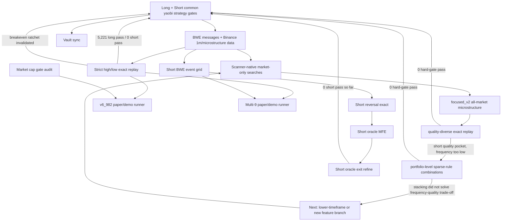

# Strategy Search Relationships

## Key Links

- [[codex_discovery/runs/20260503T021854Z_exact_v6_state_machine_replay_all_objective_unique/exact_v6_state_machine_replay|Strict replay: 5,221 long pass, 0 short pass]]
- [[codex_discovery/runs/20260503T051140Z_market_native_micro_stream/market_native_micro_stream|Focused scanner-native search: 0 pass]]
- [[codex_discovery/runs/20260503T055317Z_market_native_quality_exact/market_native_quality_exact|Quality-diverse exact replay: 0 pass]]
- [[codex_discovery/runs/20260503T061922Z_market_native_portfolio_combo/market_native_portfolio_combo|Short portfolio combo: 0 pass]]
- [[codex_discovery/runs/20260503T062415Z_market_native_portfolio_combo/market_native_portfolio_combo|Long portfolio combo: 0 pass]]
- [[30_REPORTS/2026-05-02_exact_high_low_retest|Strict High/Low Retest Report]]
- [[paper_test/v6_982b322524d6a28283/README|v6_982 paper/demo runner]]
- [[paper_test/v6_982b322524d6a28283/reports/2026-05-03_marketcap_filter_impact|Market-cap filter impact]]
- [[paper_test/v6_982b322524d6a28283/reports/2026-05-03_paper_demo_setup_status|Paper/demo setup status]]
- [[paper_test/v6_multi_8/README|Multi-9 paper/demo runner]]
- [[paper_test/v6_multi_8/reports/2026-05-03_multi8_paper_setup_status|Multi-9 setup status]]
- [[codex_discovery/runs/20260503T001701Z_short_oracle_exit_refine/short_oracle_exit_refine|Short exit refine: no pass]]
- [[99_ADMIN/VAULT_SYNC_LOG|Vault sync log]]
